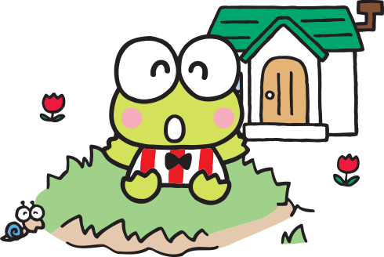

<!-- page_number: true -->




JS JS TIME
===
##### chapter 5. For - of

---

# 1. Duck Typing

`Duck Typing`이란, 클래스의 상속이나 인터페이스의 구현으로 자료형을 판단하는 것이 아닌, 인스턴스의 값이나 속성을 기준으로 해당 객체를 판단하겠다는 의미입니다.
<br>
> 컴퓨터 프로그래밍 분야에서 덕 타이핑(duck typing)은 동적 타이핑의 한 종류로, 객체의 변수 및 메소드의 집합이 객체의 타입을 결정하는 것을 말한다. 
> https://ko.wikipedia.org/wiki/%EB%8D%95_%ED%83%80%EC%9D%B4%ED%95%91

---

`Duck Typing`과 `자바스크립트`는 매우 밀접한 관계에 있습니다. 이는 자바스크립트가 동적 타입 언어임에서 부터 기인합니다. 
<br>
>비유적으로 설명하자면,
Static type의 세상에선 누군가 요리를 하기 위해서 자격증을 발급받아야 하지만, Dynamic Type의 세상에선 요리를 배우기만 하면된다. 즉, 요리를 시키기 위해서 요리사 자격증을 확인해야하는지, 요리를 할 수 있는지를 알아야하는지의 차이이다.

---

대표적인 예시로 오리에 관한 이야기가 있습니다. `Duck Typing`이 유래된 `Duck Test`에 관한 코드입니다.

```js
class Bird {
  quack () {
    console.log('꽥 꽥!')
  }
  
  walk () {
    console.log('뒤뚱 뒤뚱!')
  }
}

class Person {
  quack () {
    console.log('나는 오리로 분장했어요.')
  }
    
  walk () {
    console.log('뒤뚱 뒤뚱 오리처럼 걸어요!')
  }
}
```


---

`Bird`나 `Person`이나 모두 `quack`처럼 울 수 있고 `walk`로 걸을 수 있으니 오리로 간주하겠다는 것이죠.

좀 더 단순하게 보자면 A 클래스와 B 클래스가 가진 함수가 같다면 A클래스와 B클래스를 동일한 타입으로 본다는 것입니다.

정적 타입 언어 유저들은 이에 대해 상당한 불안감을 표하곤 하지만, 사실 이 부분에서 문제가 발생한다면 애초에 인터페이스 설계가 잘못 되었을 확률이 더 높습니다. 

---

# 2. while, for 

자바스크립트는 반복문에 대해 여러가지 형태를 제공합니다. 

```
let i = 0
while (i < 10) {
  i++ 
}

for (let i = 0; i < 10; i++) {
  // code
}
```
반복문에는 반드시 세가지 코드가 존재합니다. `초기값`, `조건문`, `증감식`이 그것입니다. 

---
# 3. forEach

자바스크립트의 반복문은 언어적으로 필요한 복잡한 값들을 표시하지 않고 루프를 추상화하여 수행할 수 있도록 도와줍니다. 
```js
const arr = [1,2,3,4,5]
arr.forEach(v => console.log(v))
const arr2 = arr.map(v => v+1) // [2,3,4,5,6]
const isSome = arr.some(v => v>3) // true
const isEvery = arr.every(v => v>3) // false
```
이는 자바스크립트 유저로 하여금, 특별한 케이스가 아니라면 최대한 추상화된 반복문을 사용하는 것을 권고하고 있습니다.

---
# 4.for - of

`for-of`문은 전달받은 `iterable`을 수행하여 `iterator`를 얻고 `IteratorResult`의 `done`이 `true`를 반환할 때까지 실행하여 값을 전달해줍니다. 
<br>
그렇다면 계속 언급되는 `Iterable`은 무엇일까요? `for-of`를 살펴보기 전에 `Iterable`에 대해서 알아봅시다. 

---
# 5. Iteration
`Iteration`의 사전적 의미는 되풀이, 반복입니다. 
`Iteration`은 반복 처리를 나타내며, 이를 위한 `protocol`을 가지고 있습니다.
>여기서 `protocol`이란 규약을 의미합니다. 
>즉, `iteration`에는 `iteration`을 위한 규약이 존재합니다. 

<br>

바로 `Iterable`과 `Iterator`입니다. 

---
# 5-1. Iterable Protocol
Javascript가 기본적으로 갖고 있는 String, Array, Map, Set, TypedArray, Argument 오브젝트는 기본적으로 `Iterable Protocol`을 가지고 있습니다. ( + DOM의 NodeList ) 

```js
const el = document.getElementsByClassName('box') // NodeList
```
위의 언급한 객체들을 `Iterable Protocol`을 갖고 있는 객체, 
즉 `Iterable Object`라고 부릅니다. 

---
해당 객체에 console.dir을 사용하여 살펴보면 __proto__에 Symbol.iterator가 있다는 것을 확인할 수 있습니다. 


자체 Object에 없어도, 상속 받은 prototype chain에 Symbol.iterator가 존재한다면 해당 객체 또한 `Iterable Object`가 됩니다.

단순히 얘기하자면 `Iterable Object`를 만들기 위해선  `iterable`이 아닌 객체에 `Symbol.iterable`을 추가해주면 됩니다. 

<hr>

`Iterable Protocol`은 말 그대로 `Iterable`에 대한 규약이기 때문입니다. 

---
# 5-2. Iterator Protocol
`Iterator Protocol`은 `Iterable Object`의 값을 차례대로 처리할 수 있는 방법을 제공합니다. `next()`함수를 통해 순서대로 값을 처리할 수 있습니다. 

즉, `Iterable object`는 반복 가능한 오브젝트이며, `Iterator protocol`은 `Iterable Object`의 값을 작성한 순서대로 처리하는 규칙입니다. 

```js
let arrayObj = [1,2]

// iterator로부터 iterable object를 획득
let iteratorObj = arrayObj[Symbol.iterator]() 
iteratorObj.next()
iteratorObj.next()
iteratorObj.next()
```

---

### Array
```js
const iterable = [10, 20, 30];

for (let value of iterable) {
  console.log(value) // 10, 20, 30
}
```
### String
```js
const iterable = '12345'

for (let value of iterable) {
  console.log(value) // 1, 2, 3, 4, 5
}
```
---
### Map
```js
const iterable = new Map([
  ['a', 1], 
  ['b', 2], 
  ['c', 3]
])

for (let [key, value] of iterable) {
  console.log(key, value)
  // a, 1
  // b, 2
  // c, 3
}
```
### Set
```js
const iterable = new Set([1, 1, 2, 2, 3, 3]);

for (let value of iterable) {
  console.log(value) // 1, 2, 3
}
```
---
### Generator
```js
function * generator () {
  yield 1
  yield 2
  yield 3
}

for (let value of generator()) {
  console.log(value) // 1, 2, 3
}
```
---
### Object
```js
let obj = {
  [Symbol.iterator]() {
    return {
      maxCount: 2,
      count: 0,
      next() {
        if (this.count < this.maxCount) {
          return { value: this.count++, done: false }
        }
        return { value: undefined, done: true }
      }
    }
  }
}
let iteratorObj = obj[Symbol.iterator]();

console.log(iteratorObj.next());
console.log(iteratorObj.next());
console.log(iteratorObj.next());
```

---
### Generator
```js
let obj = {}
obj[Symbol.iterator] = function*() {
	yield 10;
	yield 20;
	yield 30;
}

let iterableObj = obj[Symbol.iterator]()
console.log(iterableObj.next())
console.log(iterableObj.next())
console.log(iterableObj.next())

```

---


# THX :D


